# 🧠 Kairos — Multimodal Emotional Memory for Mental Health Support

**Kairos** is a **multimodal mental health support system** that detects *hidden emotional patterns over time* by fusing **what a user says**, **how they say it**, and **how those signals evolve temporally**.

Unlike text-only chatbots, Kairos treats every interaction as a **persistent emotional moment**, storing it in a structured memory that enables *longitudinal reasoning, associative recall, and early risk detection*.

> **Core idea:** Mental health signals often hide in *patterns*, not single messages.  
> Kairos is built to remember and reflect those patterns back to the user.

---

## ✨ Key Capabilities

- **Multimodal Understanding**
  - Text semantics (topics, intent, linguistic markers)
  - Acoustic-emotional biomarkers (prosody, pauses, jitter, sentiment)
  - Temporal trajectories (emotional evolution across turns)

- **Persistent Emotional Memory**
  - Remembers emotional context across turns and sessions
  - Detects repetition, escalation, and recovery patterns

- **Masked Emotion Detection**
  - Identifies contradictions between *content* and *delivery*
  - Example: *“I’m fine”* + flat prosody + low sentiment → potential distress

- **Associative Recall (Graph-RAG)**
  - Surfaces emotionally related memories (`friend → birthday → guilt`)
  - Enables contextual reflection instead of keyword recall

- **Safety-Aware Reasoning**
  - Dedicated crisis detection pipeline
  - Salience-based memory prioritization
  - Conservative, supportive interventions (no diagnosis)

---

## 🧩 System Architecture (High-Level)

Kairos follows a **four-layer architecture** designed for clarity, extensibility, and safety.

### Architecture Overview

```mermaid
flowchart TD
    A["Input & Capture\n(Text · Audio · Video)"]
    B["Multimodal Understanding\nSemantic · Acoustic · Temporal"]
    C["Memory & Retrieval\nQdrant · Graph-RAG"]
    D["Reasoning & Response\nSafety · Pattern Detection · Reflection"]

    A --> B
    B --> C
    C --> D
```

**1. Input & Capture**
- Accepts user interactions via **text, audio, or video**, preserving raw signals for downstream analysis.

**2. Multimodal Understanding**
- Extracts **semantic meaning**, **acoustic biomarkers** (prosody, pauses, sentiment), and **temporal changes** across turns.

**3. Memory & Retrieval (Qdrant + Graph-RAG)**
- Stores each interaction as a **multimodal moment vector** and retrieves relevant past moments using **hybrid multi-vector search and associative expansion**.

**4. Reasoning & Response Generation**
- Performs **safety checks**, detects **emotional patterns over time**, and generates a **supportive, context-aware response** rather than a single-turn reply.
Each user interaction is stored as a **Moment Vector** and becomes part of a persistent emotional timeline.

---

## 🧠 Moment Vector (Core Data Model)

Every interaction is represented as a **multimodal Moment Vector**:

| Channel     | Description                                  | Dimensionality |
|------------|----------------------------------------------|----------------|
| Semantic   | What is said (meaning, topics)               | 384-D          |
| Acoustic   | How it is said (prosody, voice markers)      | 32-D           |
| Trajectory | Emotional evolution across turns             | 160-D          |
| Sparse     | Explicit crisis / keyword signals             | Variable       |

All vectors are stored **together** as a single memory unit.

---

## 🚀 Why Qdrant Is Essential (Not Optional)

Kairos **cannot exist** without Qdrant’s architecture.  
This is not a tooling choice — it is an architectural dependency.

### 1️⃣ Native Multi-Vector Storage

Kairos stores **multiple orthogonal vectors per memory point** (semantic, acoustic, trajectory).

Qdrant is one of the *very few* vector databases that supports this natively.

> Example query:  
> *“Find moments where the user sounded anxious, regardless of topic.”*

This is **impossible** in single-vector systems.

---

### 2️⃣ Hybrid Retrieval with Reciprocal Rank Fusion (RRF)

Kairos runs **parallel searches** across:
- semantic similarity
- acoustic similarity
- trajectory similarity
- sparse crisis signals

Qdrant’s **Prefetch API + native RRF** fuses these rankings **server-side**, in one round-trip.

Without Qdrant:
- multiple sequential queries
- client-side fusion logic
- higher latency and brittle heuristics

---

### 3️⃣ Binary Quantization (Edge-Ready Memory)

Semantic vectors are binary-quantized:

- **1536 bytes → ~48 bytes per vector**
- ~32× memory reduction
- Enables **local / edge deployment**
- Preserves high recall via two-stage search

This is critical for **privacy-sensitive mental health data**.

---

### 4️⃣ Graph-RAG via Prefetch

Kairos maintains an **entity–emotion graph** that expands memory queries: 
“best friend”
↓
“birthday” → “guilt”
Qdrant executes these expansions **in parallel** using Prefetch and merges them with RRF, enabling **associative recall**.

---

## 🧠 Three-Layer Memory Design

Kairos uses a **cognitive memory model**, not a flat database:

### Layer 1 — User Profile (Facts)
- Name, relationships, stable attributes
- Deterministic, O(1) access

### Layer 2 — Episodic Memory (Qdrant)
- Multimodal Moment Vectors
- Searchable across sessions
- Supports similarity + filtering

### Layer 3 — Entity–Emotion Graph
- Associative links between entities and emotions
- Drives Graph-RAG expansion
- Continuously updated from memory usage

This bidirectional interaction is a **core innovation**.

---

## 🔍 What Makes Kairos Different

| Traditional Systems | Kairos |
|--------------------|--------|
| Text-only           | Multimodal (text + audio + time) |
| Stateless           | Persistent emotional memory |
| Literal recall      | Associative recall |
| Reactive            | Pattern-aware & reflective |
| Single-turn logic   | Longitudinal reasoning |

Kairos doesn’t just respond — it **reflects emotional patterns** the user may not consciously notice.

---
## 🚀 How to Run (Google Colab)

Kairos is designed to run entirely inside **Google Colab** with minimal setup.

### Prerequisites
- A Google account (for Colab access)
- The project ZIP file (download link provided below)

---

### Step-by-Step Instructions

1. **Download the Project ZIP**
   - Download the repository ZIP file from the **Google Drive link provided in this README**.
   - Link :- https://drive.google.com/file/d/1xdb3vwwuVQ0RnN1_RnpbdHS46xuZsOyD/view?usp=sharing
   - Do **not** extract the ZIP locally.

2. **Open Google Colab**
   - Visit: https://colab.research.google.com
   - Click **New Notebook**

3. **Copy the Starter Cell**
   - Open the repository ZIP locally (or preview it on GitHub).
   - Locate the file named `colab_starter_cell.py` (or the starter cell section in the README).
   - Copy the entire contents of the starter cell.

4. **Paste and Run**
   - Paste the copied cell into the **first cell** of the Colab notebook.
   - Run the cell.

5. **Upload the ZIP When Prompted**
   - When prompted by the notebook, upload the **same ZIP file** you downloaded earlier.
   - The system will automatically extract dependencies and initialize Kairos.

6. **Start Interacting**
   - Once setup completes, follow the on-screen instructions to interact using:
     - Text
     - Audio
     - Video

---

### Notes
- No local environment setup is required.
- Qdrant runs in **local embedded mode** inside Colab.
- All processing happens within the Colab session.
- Use Colab T4 for better experience.
## ⚠️ Prototype Status & Limitations

This repository represents a **research prototype**:

- Some memories may be missed or under-weighted
- Acoustic features depend on input quality
- Cold-start sessions lack trajectory history
- Not a clinical diagnostic tool

These are **known and documented limitations**, not design oversights.

---

## 🔐 Ethics & Safety

- Kairos is a **support system**, not therapy
- Explicit crisis pathways with emergency guidance
- Conservative language (no diagnoses or certainty)
- Designed for **privacy-first, local deployment**

---

Kairos demonstrates how **vector databases can act as cognitive memory systems**, not just search engines.

By combining **multimodal embeddings**, **associative graphs**, and **temporal reasoning**, it moves mental health AI from **reactive chat** to **reflective support**.
